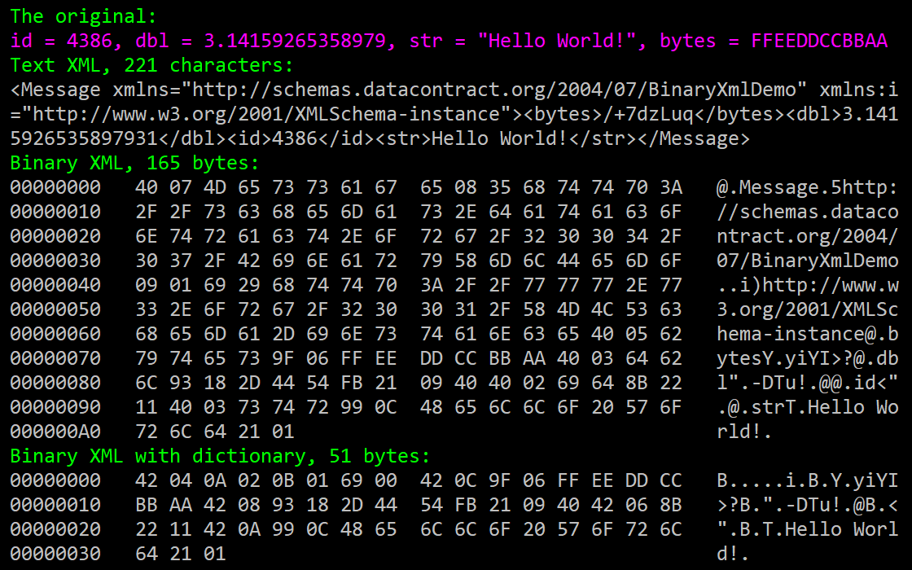

# Binary XML Demo

This small example shows how to use the binary XML format in .NET. The particular example uses .NET Core 2.0 but the code can be used in most other versions/editions of the framework.

Many developers know [data contract serializer](https://docs.microsoft.com/en-us/dotnet/api/system.runtime.serialization.datacontractserializer?view=netframework-4.7.2) class can be used to read & write objects to XML.

The XML format is human readable and human editable. DCS provides some degree of compatibility between versions, the reader constructs objects with default constructors, and it ignores XML elements not found in the CLR types. DCS is also relatively good choice in terms of security, it fails gracefully on unknown types, the reader supports quotas, etc…

The obvious downside is performance. XML documents take more space than JSON, and much more space than binary formats like protobuff or thrift.

Microsoft’s .NET binary XML format is little known feature of .NET framework that allows using the same DCS with binary XML format instead of the classic text XML.

Here’s the output of the `demoSize()` function.



I’ve been using this approach from time to time on different platforms.

1. For a client-server network protocol as a part of [WCF](https://docs.microsoft.com/en-us/dotnet/framework/wcf/whats-wcf), in net-tcp transport. The server was based on .NET framework; the clients used mono in Unity3D. Unfortunately at that time Unity3D didn’t support binary XML so I had to implement the support myself. The server used the Microsoft’s stack.

2. To store preferences & settings in an isolated storage in a windows phone app, the same way `[NSUserDefaults standardUserDefaults]` worked on iOS.

3. For a client-server network protocol without WCF, on top of TCP and UDP sockets. Server was an embedded ARM Linux running .NET core, clients were windows PCs running classic .NET. This is especially useful for UDP, because UDP packets are often limited in size to ~ 512 bytes of payload.

## Limitations

It’s possible to implement support for this format for other languages, [the spec is open](http://download.microsoft.com/download/9/5/E/95EF66AF-9026-4BB0-A41D-A4F81802D92C/[MC-NBFX].pdf), however I’m not sure it’s a good fit for heterogeneous environments. It’ll take considerable time to implement and debug, however protobuff  already does the job quite well not requiring too much efforts.

As you see from the result, the most bandwidth is saved by the pre-shared dictionary that substitutes all these namespaces and property name strings with small integer numbers. However, if your protocol is very complex i.e. hundreds of message classes, and/or if it evolves too fast, maintaining that dictionary might become a burden. It’s possible to use reflection to automate, but that would break compatibility across versions, i.e. you remove a field from your class, half of the string IDs change, and your app will refuse to read data written by a previous version.

It’s much easier to debug and troubleshoot stuff with human-readable data, such as text XML, going to the disk or network. Only use binary formats when your performance or bandwidth requirements justify that.
